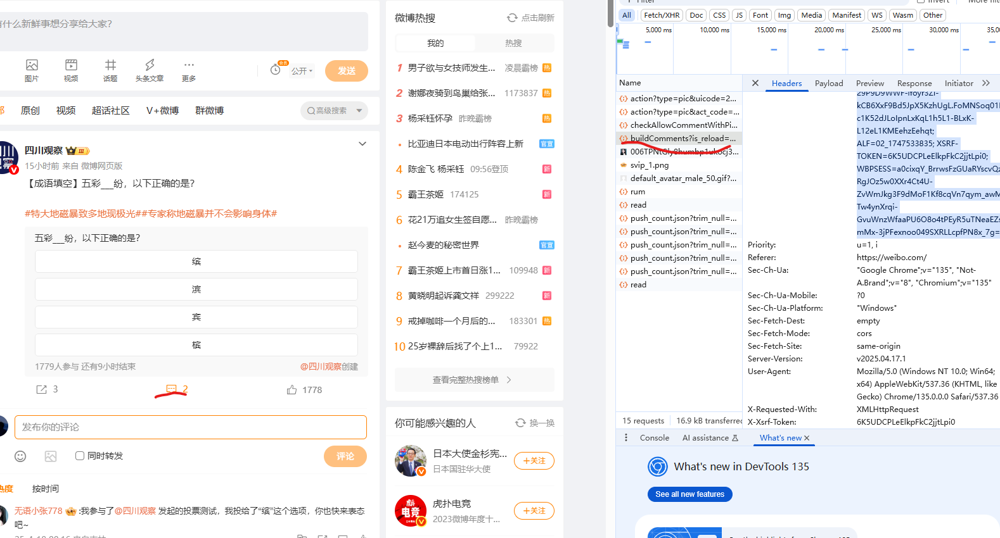

## 爬虫

### 介绍

该项目用来爬取 微博平台 数据

## 环境

- python>=3.8
- pandas>=2.0.3
- parsel>=1.9.1
- Requests>=2.32.3
- rich>=13.7.1

## 功能

### 获取主题内容
```python
q = "#姜萍中考621分却上中专的原因#"  # 话题
kind = "综合"  # 综合，实时，热门，高级
cookie = "" # 输入cookie
wbparser = WBParser(cookie)
wbparser.get_main_body(q, kind)
```
### 获取一级评论
```python
q = "#姜萍中考621分却上中专的原因#"  # 话题
kind = "综合"  # 综合，实时，热门，高级
cookie = "" # 输入cookie
wbparser = WBParser(cookie)
wbparser.get_comments_level_one()
```
### 获取二级评论

```python
q = "#姜萍中考621分却上中专的原因#"  # 话题
kind = "综合"  # 综合，实时，热门，高级
cookie = "" # 输入cookie
wbparser = WBParser(cookie)
wbparser.get_comments_level_two()
```

## 使用

### 安装依赖

```python
pip install -r requirements.txt
```

### 设置

#### 话题

话题需要用两个 `##` 间隔，例子如下

\#姜萍中考621分却上中专的原因\#

#### 类型

类型有 综合，实时，热门，高级 四种方式，对应微博的四种检索方式

#### cookie

cookie 的 获取方式如下

https://weibo.com/




点击某个帖子的评论
获取
https://weibo.com/ajax/statuses/buildComments?。
这个前缀地址的cookie 

添加到代码中

### 运行

目前爬取的数据默认数据库和本地都保存一份。需要正确配置数据库地址。

```CREATE DATABASE IF NOT EXISTS yuqin_manage CHARACTER SET utf8mb4```; 
创建数据库


创建数据库和相关表可以执行dump.sql ，可以执行 dump.sql 创建对应的表


```python
python -m spider.main
```
只想在本地跑数据采集代码，直接保存为csv 分析相关数据，拉取下边项目地址
```
git clone https://github.com/jintao0693/weibo_spider_data.git
 ```
安装相关配置,启动项目


# 后端模块

相关配置文件
mysql ,redis


# docker 启动 
导入基础镜像
docker load -i drill_yuqin_base.tar
启动项目
docker-compose up -d
http://localhost:6895/


！多人演练室使用后台任务调度deepseek 生成评论
需要替换deepseek api key


### 前端   
docker-compose up -d 可以启动。  docker 启动可以不修改，默认访问docker 内部容后端器地址
如果要修改后端地址 修改nginx.conf 文件
proxy_pass 地址


